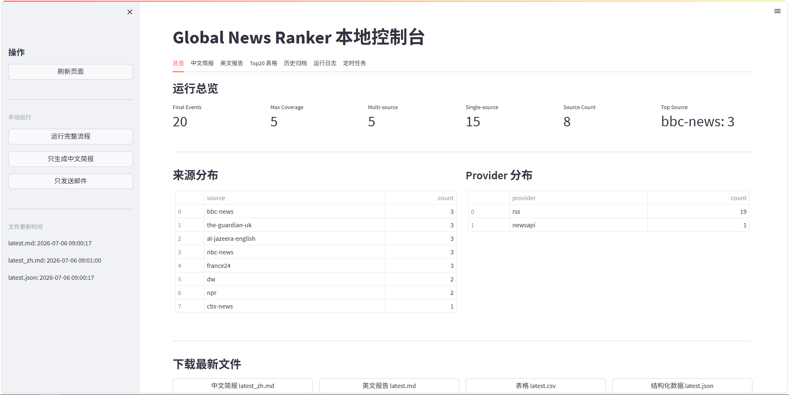
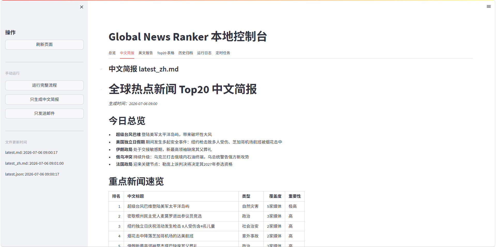
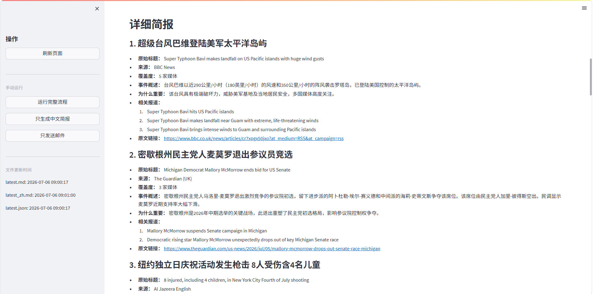
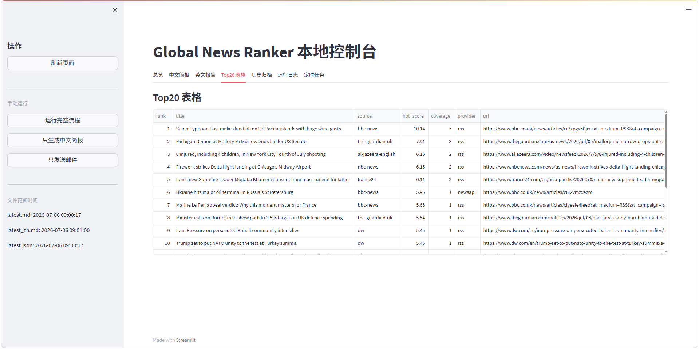
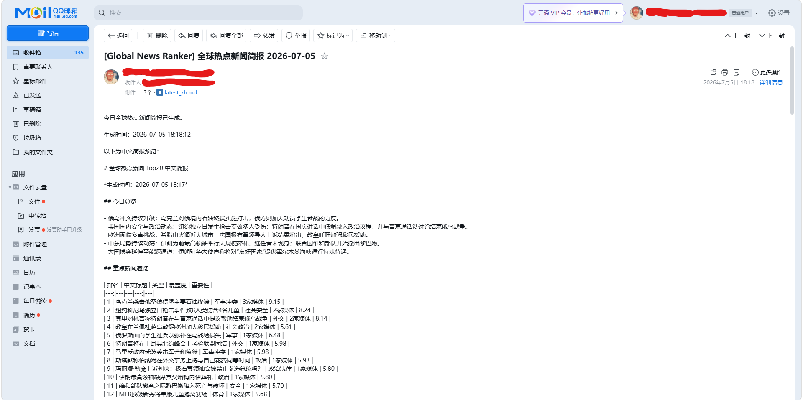

# Global News Ranker

AI-powered Global News Intelligence Automation System.

## Features

- Collect global news from NewsAPI and RSS feeds
- Filter low-value content such as sports, entertainment, video-only, and soft news
- Deduplicate similar articles
- Cluster articles into news events
- Rank the top 20 global news events
- Export Markdown, CSV, and JSON reports
- Generate Chinese briefings with DeepSeek API
- Send daily email reports through QQ SMTP
- Provide a local Streamlit dashboard
- Run automatically through Windows Task Scheduler

## Tech Stack

- Python
- Streamlit
- NewsAPI
- RSS
- DeepSeek API
- QQ SMTP
- PowerShell
- Windows Task Scheduler

## Run

Install dependencies:

pip install -r requirements.txt

Create environment file:

copy .env.example .env

Run pipeline:

python main.py
python generate_chinese_brief.py
python send_email_report.py

Start dashboard:

powershell -NoProfile -ExecutionPolicy Bypass -File .\run_ui.ps1

Open:

http://127.0.0.1:8501

## Example Outputs

Sample outputs are stored in example_outputs:

- latest.md
- latest_zh.md
- latest.csv
- latest.json

## Security

Do not commit .env, API keys, SMTP app passwords, logs, or production archives.

## Screenshots

### Dashboard Overview

### Chinese Briefing

### Top 20 Table

### Email Delivery

